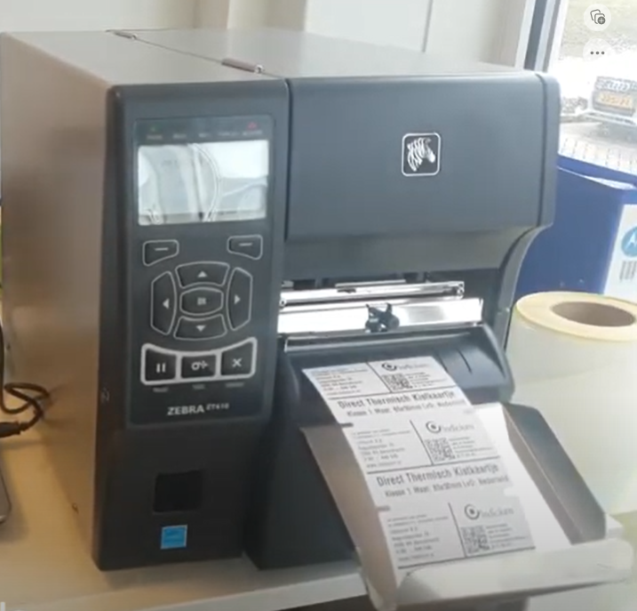
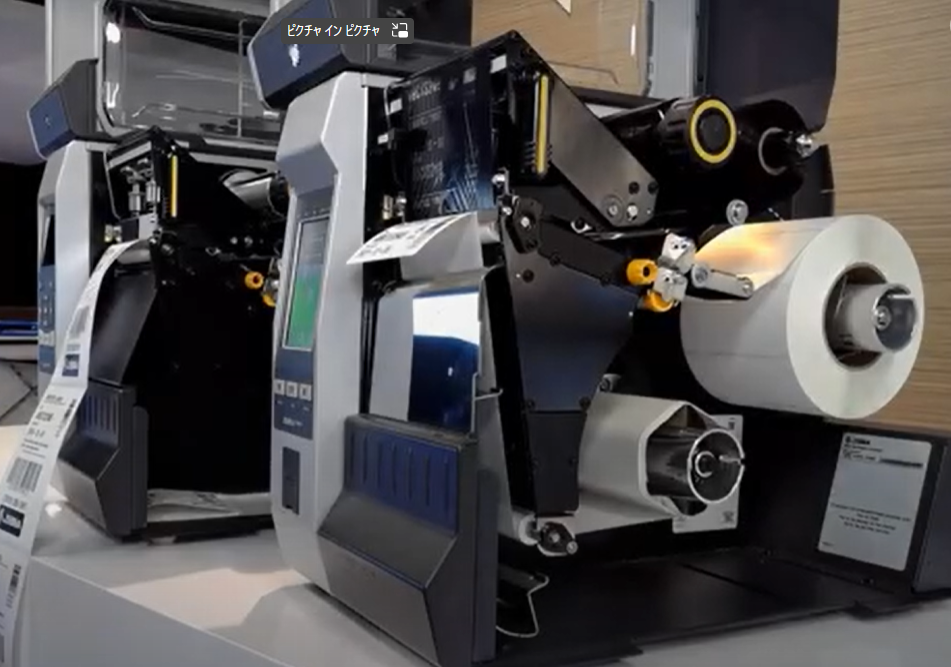
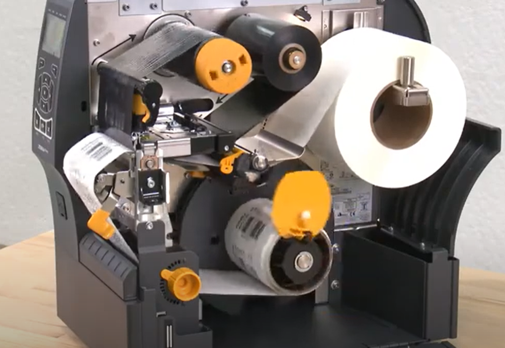
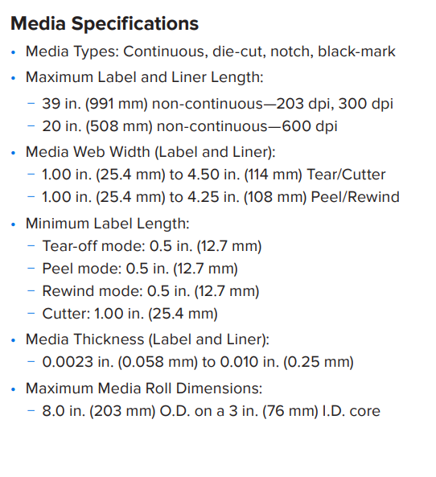
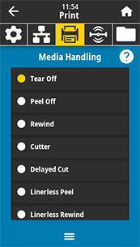
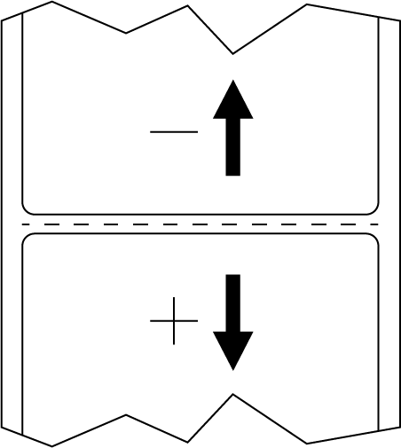
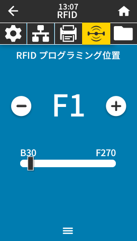
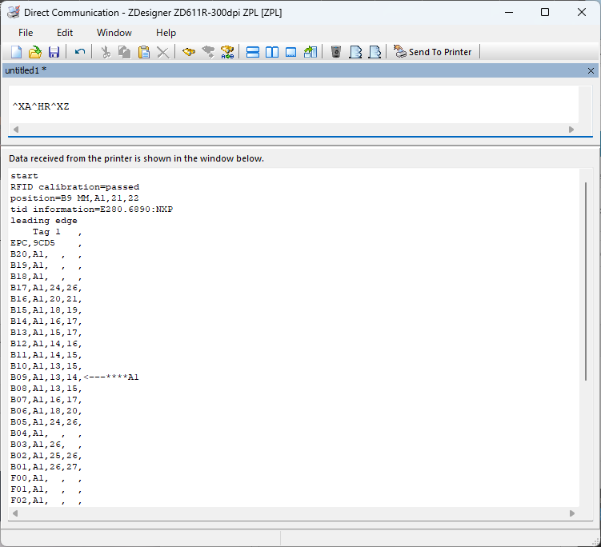

 

### なぜRFIDプリンタにカッターが利用できないという迷信が広まるのか
#### ～ 実機で用紙オプションの基本をしっかり理解する ～

 
 
 

---

## 用紙オプションに苦手意識を持っている人は意外に多い
 

- 見たことない
- 触ったことがない
- 調べ方がわからない
- オプション組み合わせがわからない
 

→ 実はお客様視点でも同じ。だから、しっかり理解する必要がある。

<!-- 
お客様視点でも同じなので、意外と質問が多い。
プロフェッショナルとして恥をかかないよう、正確な受け答えができるようにしておくことが肝要。
結論：顧客サポートにおいては非常に重要。（特にRFIDオプション利用時）
-->

--- 

## 用紙オプションとはなにか？

用紙に対して、特定の操作を加えるもの  

 

1. カッター
1. 剥離
1. フルリワインダー
1. ハーフリワインダー
1. RFIDオプション
    

        ハーフとフルリワインダーは間違えないようにしよう

---

## 利用可能なオプションは機種によって異なる

 
 

| 機種 | カッター | 剥離 | ハーフR | フルR | RFID | 
|-|:-:|:-:|:-:|:-:|:-:|
| モバイル         | × | △ | × | × | △ | 
| デスクトップ     | 〇 | 〇 | × | × | △ | 
| テーブルトップ    | 〇 | 〇 | 〇 | 〇 | 〇 | 
| リストバンド      | × | × | × | × | × | 

 

△ --- 一部モデルのみ対応

---

## キッティングの手順
 

1. 用紙オプションの取付
   
        同梱のマニュアルに沿って、オプションを取り付ける。

     

2. 用紙のセッティング
   
        用紙スペック、用紙オプションに従い適切な設定を行う。

 

わからない場合はzebra.com > 製品サポートページの動画を見よう。

---

<!-- _class: sub-title -->

# 用紙オプションを理解しよう

---
<!-- _class: sub-distitle -->

## カッターとキャッチトレイ
    用紙をカットする

#### ハード構成  
1. カッター
2. キャッチトレイ (ZT Only)

#### 用紙設定
- Cutter 
- Delay Cut

---

## Cutter とDelay Cut モードの違い

カットするタイミングやカット方法によって使い分ける

#### Cutter モード
    - バッチ（^XA^XZ)終了時のタイミングで自動カットしたい方向け。
    - 3枚印刷→カットのように特定のパターンでカットする場合に多用される。
    - ^XB発行のバッチはカットを抑制できる。

#### Delay Cut モード
    - 任意のタイミングでカットしたい方向け。
    - カットタイミングがランダムに発生する現場で用いられることが多い。
    - カットコマンド*実行タイミングでカットされる。
        * ZPL: ~JK / SGD: media.cut_now
        ** 順次処理には不向き

<!--
Run Script
sample_2x1_200dpi_cutter-mode.prn
sample_2x1_200dpi_delayed-cutter-mode.prn
-->

---

### Sample ZPL - Cutter Mode

    -- Cut 
    ^XA
    ^MMC
    ^PW406
    ^FT27,68^A0N,31,30^FH\^CI28^FDCut!!^FS^CI27
    ^XZ

    -- Do not Cut
    ^XA
    ^XB
    ^MMC
    ^PW406
    ^FT27,68^A0N,31,30^FH\^CI28^FDDo not Cut!!^FS^CI27
    ^XZ

    -- Cut 
    ^XA
    ^MMC
    ^PW406
    ^FT27,68^A0N,31,30^FH\^CI28^FDCut!!^FS^CI27
    ^XZ

---

### Sample ZPL - Delay Cut Mode

    -- Print
    ^XA
    ^MMD
    ^PW406
    ^LL203
    ^LS0
    ^FT27,68^A0N,31,30^FH\^CI28^FDCut!!^FS^CI27
    ^BY3,3,41^FT47,137^BCN,,Y,N
    ^FH\^FD>;123456789012^FS
    ^PQ3
    ^XZ

    -- Cut Now!!
    ! U1 do "media.cut_now" ""

---
## 剥離と台紙巻き取り
    - 台紙とラベルを分離する
    - 処理済み台紙を巻き取る
  
#### ハード構成  
1. ピーラー
2. ハーフリワインダー(ZT Only)

#### 用紙設定
- Rewind 
- ^XA^MMP^XZ
- ! U1 setvar "media.printmode" "peel"

<!--
Run Script
sample_2x1_200dpi_peel-mode.prn
-->

---
## 用紙巻き取り
    - 印刷済みラベルを巻き取る
  
#### ハード構成  
1. フルリワインダー(ZT Only)

★ フィールドインストール不可。

#### 用紙設定
- Rewind 
- ^XA^MMR^XZ
- ! U1 setvar "media.printmode" "rewind"

<!--
Run Script
sample_2x1_200dpi_rewind-mode.prn
-->

---
### Sample ZPL - Rewinder Mode
    ^XA
    ^MMR
    ^PW1200
    ^FT79,201^A0N,92,91^FH\^CI28^FDZebra Technologies Japan^FS^CI27
    ^BY9,3,120^FT140,405^BCN,,Y,N
    ^FH\^FD>;123456789012^FS
    ^PQ5,0,1,Y
    ^XZ

### Sample ZPL - Peeler Mode
    ^XA
    ^MMP
    ^PW406
    ^FT27,68^A0N,31,30^FH\^CI28^FDPeel test!!!^FS^CI27
    ^PQ5
    ^XZ

---

## よくある勘違いとミス

1. RFID + Cutter は非サポート
    
        サポート可。適切な対応をすることで利用できることが多い。
        調整・設定者はプリンタ・RFラベルへの知見が必須。
2. フルリワインダーは後付けできる
   
        後付けできない。ハーフRとフルRの違いがわからないための発注ミスや
        後付けできると顧客に説明し、後々のトラブルとなることが多い。
3. Silverlineでピーラーが利用できる
   
        利用不可。Silverlineラベルはその物理的特性により、カッター・ピーラー・フルリワインダーなどの
        用紙オプションの利用は非サポート。

---
### オプション利用時は用紙要件が異なる

 

機種・用紙オプションの種類によって、利用できる用紙スペックが異なる。詳細はTech Specsを参照すること。

- Media Width
- Minimum Label Length
  
   

    カッター利用時は特に長いラベル長が求められることを理解しよう。

---

<!-- _class: sub-title -->

# Let's Play

---

## 知っておくべき重要な設定値

- ラベル停止位置

        カット、剥離、切り取り位置の微調整。
- RFID エンコードポジション

        RFIDタグのエンコード位置。ラベルピッチ 25mm 以下は特に重要。

 

特に用紙オプション+ RFID利用時はバックフィード量のコントロールが鍵

---

## 実習1 (基本)

1. 用紙オプションのモードを設定しよう。
   
        「用紙オプションモードの変更」をみながら、適切なモードに設定してみよう。

2. 印刷後のラベル停止位置を調整してみよう。
   
        「ラベル停止位置の調整」をみながら、ラベル停止位置を調整してみよう。

---
## 用紙オプションモードの変更
カット、剥離、切取り時の停止位置を設定。
 

|||
|-|-|
| 有効値| Tear Off, Peel Off, Rewind, Cutter, Delayed Cut, Linerless Peel, Linerless Rewind, Linerless Tear, Applicator, Linerless Cut, Linerless Delayed Cut
| ZPL コマンド| ^MM
| SGD コマンド| media.printmode
| フロントパネル | [印刷] > [イメージ調整] > [用紙処理]

---
## ラベル停止位置の調整
カット、剥離、切取り時の停止位置を設定。
 

|||
|-|-|
| 有効値| -120 ～ +120
| ZPL コマンド| ~TA###
| SGD コマンド| ezpl.tear_off
| フロントパネル | [印刷] > [イメージ調整] > [切り取線オフセット]

---

### Sample ZPL - Cutter Mode

    -- Cut 
    ^XA
    ^MMC
    ^PW406
    ^FT27,68^A0N,31,30^FH\^CI28^FDCut!!^FS^CI27
    ^XZ

    -- Do not Cut
    ^XA
    ^XB
    ^MMC
    ^PW406
    ^FT27,68^A0N,31,30^FH\^CI28^FDDo not Cut!!^FS^CI27
    ^XZ

    -- Cut 
    ^XA
    ^MMC
    ^PW406
    ^FT27,68^A0N,31,30^FH\^CI28^FDCut!!^FS^CI27
    ^XZ

---

### Sample ZPL - Delay Cut Mode

    -- Print
    ^XA
    ^MMD
    ^PW406
    ^LL203
    ^LS0
    ^FT27,68^A0N,31,30^FH\^CI28^FDCut!!^FS^CI27
    ^BY3,3,41^FT47,137^BCN,,Y,N
    ^FH\^FD>;123456789012^FS
    ^PQ3
    ^XZ

    -- Cut Now!!
    ! U1 do "media.cut_now" ""

---
### Sample ZPL - Rewinder Mode
    ^XA
    ^MMR
    ^PW1200
    ^FT79,201^A0N,92,91^FH\^CI28^FDZebra Technologies Japan^FS^CI27
    ^BY9,3,120^FT140,405^BCN,,Y,N
    ^FH\^FD>;123456789012^FS
    ^PQ5,0,1,Y
    ^XZ

### Sample ZPL - Peeler Mode
    ^XA
    ^MMP
    ^PW406
    ^FT27,68^A0N,31,30^FH\^CI28^FDPeel test!!!^FS^CI27
    ^PQ5
    ^XZ

---

## 実習2 (基本)

1. ラベル停止位置の微調整をしてみよう。

         - カットの場合、ラベル間のど真ん中でカットしてみよう。
         - また、前のラベル近辺でカットしてみよう。
         - 剥離の場合、適切に剥離できる位置に微調整をしよう。
  
1. ラベル停止位置を大きく変えてラベルドロップ現象を再現してみよう

        どのあたり設定値でラベルドロップが発生するのか確認してみよう。

---

## 実習3 (応用)

1. スペックシートを参照し、ラベルがスペック外で無いことを確認する。

1. RFID のマニュアルキャリブレーションを実行し、エンコードスポットを確認してみよう。

         - Tear off モードで^XA^HR^XZを実行し、返り値（RFログ）を確認しよう。
         - 返り値から最適なエンコードスポットと設定値を割り出そう。
  
2. オートキャリブレーションより浅いエンコードポジションを設定し、印刷してみよう。
   
        ラベルドロップが発生せず、エンコードができていることを確認しよう。

### # 重要 # カッター利用時のコツ
> 1. カット位置はできるだけ前のラベル寄りが良い
> 2. エンコード位置はできるだけF0に近い方が良い

---
## RFID プログラミング位置
RFIDのエンコードポイントの設定。カッター利用時はできるだけ、Backfeedが浅めの設定にすると良いことが多い。

|||
|-|-|
| 有効値| Bxxx ～ F0 ～ Fxxx
| ZPL コマンド| ^RS
| SGD コマンド| rfid.position.program
| フロントパネル | [RFID] > [RFID] > [RFIDプログラミング位置]

---

### マニュアルで適切なRFIDプログラミング位置を知る方法
 
RFIDオートキャリブレーションは確実にエンコードができるポイントを設定する傾向があるため、プログラミング位置が深めのbackfeed に設定されることが多い。その結果、RFID + カッター利用時にラベルのドロップの遠因となることがある。回避するにはドロップしないエンコードポイントをマニュアルをZPL/SGDコマンドで確認する必要がある。コマンド詳細は下記Articleを参照すること。

    ZT411 & ZT421 RFID Calibration
    Article ID:000018011  •  November 18, 2019
 
カッター、切り取り時は並行して、バックフィード量を最大化できるように「ラベル停止位置の調整」を実施した方が良い。

---

# Expample1： ^HRの結果

<!-- _class: smallfontsize -->
> ^XA^HR^XZ

    RFID calibration=passed
    position=B9 MM,A1,21,22
    tid information=E280.6890:NXP
    leading edge
        Tag 1   ,
    EPC,9CD5    ,
    (略)
    B11,A1,14,15,
    B10,A1,13,15,
    B09,A1,13,14,<---****A1 ★オートキャリブレーションで設定された位置
    B08,A1,13,15,
    B07,A1,16,17,
    B06,A1,18,20, ★手動設定した位置
    B05,A1,24,26, 
    B04,A1,  ,  ,
    B03,A1,26,  ,
    B02,A1,25,26,
    B01,A1,26,27,
    F00,A1,  ,  ,
    (略)

---

# Expample2： ^HRの結果

<!-- _class: smallfontsize -->
    ^XA^HR^XZstart
    RFID calibration=passed
    position=B12 MM,A4,20,22
    tid information=E280.1191:Impinj
    leading edge
        Tag 1   ,Tag 2   ,Tag 3   ,Tag 4   ,Tag 1   ,Tag 2   ,Tag 3   ,Tag 4   ,Tag 1   ,Tag 2   ,Tag 3   ,Tag 4   ,
    EPC,E280    ,440D    ,EABC    ,5F2C    ,E280    ,440D    ,EABC    ,5F2C    ,E280    ,440D    ,EABC    ,5F2C    ,

    B13,A4,  ,  ,A4,18,20,A4,  ,  ,A4,27,29,B4,  ,  ,B4,25,28,B4,  ,  ,B4,  ,  ,C4,  ,  ,C4,  ,  ,C4,  ,  ,C4,19,21,
    B12,A4,  ,  ,A4,17,19,A4,  ,  ,A4,26,28,B4,  ,  ,B4,27,28,B4,  ,  ,B4,  ,  ,C4,  ,  ,C4,  ,  ,C4,  ,  ,C4,18,20,<---****A4
    B11,A4,  ,  ,A4,18,19,A4,  ,  ,A4,25,27,B4,  ,  ,B4,30,  ,B4,  ,  ,B4,  ,  ,C4,  ,  ,C4,  ,  ,C4,  ,  ,C4,18,20,
    B10,A4,  ,  ,A4,18,19,A4,  ,  ,A4,24,26,B4,  ,  ,B4,  ,  ,B4,  ,  ,B4,  ,  ,C4,  ,  ,C4,  ,  ,C4,  ,  ,C4,17,19,
    B09,A4,  ,  ,A4,18,20,A4,  ,  ,A4,24,25,B4,  ,  ,B4,  ,  ,B4,  ,  ,B4,  ,  ,C4,  ,  ,C4,  ,  ,C4,  ,  ,C4,17,19,
    B08,A4,  ,  ,A4,16,18,A4,  ,  ,A4,21,24,B4,  ,  ,B4,  ,  ,B4,  ,  ,B4,29,  ,C4,  ,  ,C4,  ,  ,C4,  ,  ,C4,16,19,
    B07,A4,  ,  ,A4,16,18,A4,  ,  ,A4,21,23,B4,  ,  ,B4,  ,  ,B4,  ,  ,B4,25,27,C4,  ,  ,C4,  ,  ,C4,  ,  ,C4,16,18,
    B06,A4,30,  ,A4,12,14,A4,17,20,A4,27,30,B4,  ,  ,B4,30,  ,B4,  ,  ,B4,23,25,C4,  ,  ,C4,  ,  ,C4,  ,  ,C4,15,17,
    B05,A4,  ,  ,A4,16,18,A4,18,20,A4,  ,  ,B4,  ,  ,B4,  ,  ,B4,  ,  ,B4,21,23,C4,  ,  ,C4,  ,  ,C4,  ,  ,C4,15,17,
    B04,A4,  ,  ,A4,22,24,A4,20,22,A4,28,30,B4,  ,  ,B4,  ,  ,B4,  ,  ,B4,20,22,C4,  ,  ,C4,  ,  ,C4,  ,  ,C4,14,17,
    B03,A4,  ,  ,A4,25,27,A4,20,22,A4,26,28,B4,  ,  ,B4,  ,  ,B4,  ,  ,B4,19,22,C4,  ,  ,C4,  ,  ,C4,  ,  ,C4,14,16,
    B02,A4,  ,  ,A4,28,30,A4,20,22,A4,25,27,B4,  ,  ,B4,  ,  ,B4,  ,  ,B4,18,20,C4,  ,  ,C4,  ,  ,C4,  ,  ,C4,14,16,
    B01,A4,  ,  ,A4,  ,  ,A4,21,23,A4,25,28,B4,  ,  ,B4,  ,  ,B4,  ,  ,B4,17,19,C4,  ,  ,C4,  ,  ,C4,  ,  ,C4,14,16,
    F00,A4,  ,  ,A4,  ,  ,A4,23,25,A4,26,28,B4,  ,  ,B4,  ,  ,B4,  ,  ,B4,15,18,C4,  ,  ,C4,  ,  ,C4,  ,  ,C4,14,16,
    F01,A4,  ,  ,A4,  ,  ,A4,25,27,A4,26,28,B4,  ,  ,B4,  ,  ,B4,  ,  ,B4,15,17,C4,  ,  ,C4,  ,  ,C4,  ,  ,C4,14,16,
    trailing edge
    end

^XA
^RFW^FD00001^FS
^XZ

---

## 付録：印刷モードのアルゴリズム

 

|||
|-|-|
| Tear-off  | [F0] > Print > [Tear Bar] > Tear ... > **[F0]**
| Peel-Off  | [F0] > Print > [Peel Position] > Peel .. > **[F0]**.
| Cutter    | [F0] > Print > [Cut Position] > Cut ... > **[F0]**
| RFID + Tear-off   | [F0] > **[Encode Position]** > RF Encode > [F0] > Print > [Tear Bar] > Tear... > **[F0]**
| RFID + Cutter     | [F0] > **[Encode Position]** > RF Encode > [F0] > Print > [Cut Position] > Cut ... > **[F0]** 

---

## まとめ

用紙オプション利用時に絶対に押さえておくポイント。

1. 用紙/RFIDキャリブレーションを適切に行う
        
        印字起点(F0)をきちんと設定することが基本。

2. ラベルの停止位置を適切にコントロールする
   
        カット・剥離に適した停止位置を設定する。
3. バックフィード量をコントロールする ★

        バックフィード時にラベルがプラテンローラから滑落しないバックフィード量設定にする。
        RFID、カッターを利用時はバックフィード量が大きくなりがちなので要注意。
---

<!-- class: sub-title -->

# Any Questions? 

---

# テスト

https://forms.office.com/r/Saf615XnrC

---

# セミナーアンケート

https://forms.office.com/r/jWe60q98AS

---

# End 
---
